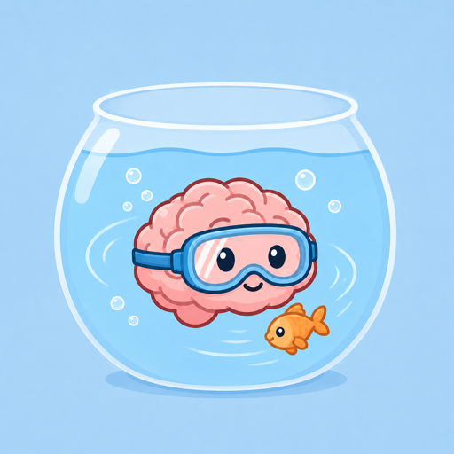

# Fishbowl

<p align="center">
  
</p>

<h2 align="center">Local-first engineering memory for humans and coding agents.</h2>

<p align="center">
  Turn failures, decisions, evidence, and verification into durable project knowledge.<br />
  Search it before the next task. Record only the facts worth keeping.
</p>

<p align="center">
  <a href="README.zh-CN.md">简体中文</a> ·
  <a href="docs/agent-bootstrap-prompt.md">Agent quick start</a> ·
  <a href="docs/mcp-client-configuration.md">MCP setup</a> ·
  <a href="SECURITY.md">Security</a> ·
  <a href="LICENSE">MIT License</a>
</p>

---

## Why Fishbowl

Engineering teams often solve the same problem twice: the important context is trapped in terminal scrollback, issue threads, and someone’s memory. Fishbowl keeps a project-local, reviewable record without pretending that every note is a proven fact.

| Keep | Avoid |
| --- | --- |
| Failed attempts, supporting evidence, decisions, fixes, and verification | Raw chat transcripts, credentials, full logs, or a cloud dependency |
| A shared knowledge graph across a repository and its worktrees | Repeating expensive investigations from scratch |
| Local SQLite, loopback-only browser access, and stdio MCP | Unreviewable autonomous “memory” |

## What You Get

- **`fishbowl` CLI** for registering projects, querying context, recording cases, and checking integrity.
- **Persistent local daemon** that owns one authenticated SQLite connection and local cache.
- **stdio MCP server** for compatible coding agents.
- **Trace Bench**, a read-only local browser for inspecting project activity.
- **Worktree-aware project aliases** so parallel branches still share the right engineering context.
- **Bounded disk observations** for regenerable artifact metadata. Fishbowl never deletes files automatically.

## Quick Start

### macOS / Linux

```bash
git clone https://github.com/nimocat/fishbowl.git
cd fishbowl
npm install
npm run build
npm link

fishbowl daemon install
fishbowl daemon doctor
```

### Windows (PowerShell)

Install Node.js 22 or newer, Git, Rust stable with the MSVC toolchain, and the Visual Studio Build Tools C++ workload, then run:

```powershell
git clone https://github.com/nimocat/fishbowl.git
Set-Location fishbowl
npm install
npm run build
npm link

fishbowl daemon install
fishbowl daemon doctor
```

The daemon runs only for the current user. No administrator account is required.
Its first fixed-endpoint launch stores one high loopback port in the private
Fishbowl data directory and reuses that port across installs and updates. An
update already running this fixed-endpoint CLI snapshots the current valid
descriptor port before shutdown, so MCP clients do not lose the daemon merely
because its process restarted. `daemon install` waits
for authenticated readiness and reports a port conflict instead of silently
moving the endpoint.

### CLI help and diagnostics

Running `fishbowl` with no arguments now prints the full command overview and
does not start the daemon. Help is available in equivalent forms:

```bash
fishbowl help
fishbowl help project register
fishbowl project register --help
fishbowl --version
```

Invalid commands and missing options return JSON with the original `message`
plus command-specific `usage`, an actionable `hint`, and the exact `help`
command to run. Use `fishbowl daemon doctor` for connectivity diagnostics and
`fishbowl integrity` for a read-only database check. Data-oriented CLI entries
remain legacy/manual-recovery compatibility only; coding Agents call Fishbowl
MCP tools directly.

### Register a Project

The following data commands are retained for explicit human recovery and
compatibility. Configure coding Agents to use the equivalent Fishbowl MCP tools.

```bash
cd /absolute/path/to/your-project
fishbowl project register \
  --root "$PWD" \
  --name "My Project" \
  --description "Local engineering knowledge"
```

Copy the returned project ID and use it in the normal loop:

```bash
fishbowl query --project "<project-id>" "export failure"
fishbowl checkpoint \
  --project "<project-id>" \
  --task "Fix export failure" \
  --outcome succeeded \
  --summary "Moved composition work off the main actor and passed focused verification."
```

## Give Fishbowl to Codex or Another Agent

Configure the user-level stdio MCP server once, then copy the [MCP Agent Session Prompt](docs/agent-bootstrap-prompt.md) into a coding agent. It tells the agent to choose a proportional LIGHT, STANDARD, or FULL workflow and to:

1. Call Fishbowl MCP tools directly and resolve the project explicitly.
2. Use compact, Case-diverse history results and expand only selected Cases.
3. Reserve preflight and disk observation for work whose risk or material artifacts justify them; use checkpoints only for real interruption or handoff.
4. Report an unavailable MCP server instead of falling back to the CLI.

The MCP client starts this persistent stdio bridge from its server configuration:

```bash
node /absolute/path/to/fishbowl/dist/cli/main.js mcp --stdio
```

See the ready-to-copy [MCP client configurations](docs/mcp-client-configuration.md). Codex must not launch this command itself or use CLI query/write commands. The configured MCP host owns the process and its stdout protocol frames.

## The Engineering Loop

```text
LIGHT:    Resolve -> Query when useful -> Answer
STANDARD: Resolve -> Brief preflight/query -> Problem -> Implement -> Commit/verify -> Finalize once
FULL:     Resolve -> Preflight/query -> Observe artifacts when material -> Problem/valuable failures -> Commit/verify -> Finalize once
```

`checkpoint_work` is an interruption primitive, not a mandatory pre-finalize
step. Use it only for context compaction, a cross-day pause, or a handoff. When
finalization follows a necessary checkpoint, pass the same `caseId`; Fishbowl
reuses exactly equivalent Attempt, RootCause, and Solution knowledge. Small
configuration edits do not justify disk observation unless they create material
retained artifacts. Human Verification is recorded only after a person confirms
the real target behavior.

Fishbowl keeps records distinct so the graph remains useful under review:

| Record | Meaning |
| --- | --- |
| Problem | The decision, incident, or task being investigated |
| Attempt | A concrete approach and its observed outcome |
| Root Cause | An evidenced causal explanation, not a guess |
| Solution | The adopted change, scope, and limitations |
| Verification | The build, test, measurement, or human review that supports it |

## Local-First by Design

```text
CLI / MCP client
       |
       v
Fishbowl daemon (current user, authenticated)
       |
       +-- SQLite knowledge store
       +-- bounded raw command-log references
       +-- Trace Bench on 127.0.0.1 only
```

- No account, hosted service, cloud sync, or telemetry is required.
- Durable graph text is recursively secret-redacted and bounded.
- Raw command logs remain local, retention-bounded, and excluded from graph exports.
- Existing repositories are never modified merely by being registered.

Read [SECURITY.md](SECURITY.md) before sharing any data directory or raw log collection.

## Upgrade from Engineering Knowledge Graph

The first Fishbowl launch migrates the legacy local database, WAL files, token, and raw logs into the Fishbowl data directory. Existing graph exports remain import-compatible; newly created exports use the `fishbowl` format marker.

Run once after upgrading:

```bash
fishbowl daemon install
```

### Updating on Windows (PowerShell)

After installing this release, routine updates are one human-run PowerShell command:

```powershell
fishbowl update
```

The command accepts only a clean checkout of the official Fishbowl `origin/main`. It fast-forwards, runs `npm ci`, builds production artifacts, refreshes `npm link`, reinstalls and starts the current-user daemon, and completes a health check. It never uses `reset --hard`, overwrites local changes, or switches branches. Knowledge under `%LOCALAPPDATA%\Fishbowl` is preserved. A failed deployment restores the prior CLI and daemon when possible; rerunning the command repairs an incomplete deployment instead of skipping merely because the source is current.

If an older release reports `Unknown command: update`, bootstrap the command once in the Fishbowl repository you originally cloned. If `git status --short` shows your own changes, commit or stash them first:

The source build requires Node.js 22 or newer, Git, Rust stable with the MSVC toolchain, and the Visual Studio Build Tools C++ workload.

```powershell
Set-Location C:\path\to\fishbowl
git status --short
git pull --ff-only origin main
npm ci
npm run build
npm link

fishbowl daemon install
```

After every successful update, fully quit and restart the MCP client (for example Codex or Claude Desktop) so it loads new MCP tools and schemas. The stable daemon port lets an existing bridge reconnect after an ordinary daemon restart, but cannot hot-reload adapter code. Agents do not need—and must not try—to locate or run `fishbowl update` or any other Fishbowl CLI themselves.

If the MCP client already points to the absolute `dist\cli\main.js` path in the same clone, its configuration does not change. If the clone moved, update it once using [Windows MCP paths](docs/mcp-client-configuration.md#windows-paths).

## Development

```bash
npm install
npm run typecheck
npm test
cargo test --workspace
npm run build
```

See [CONTRIBUTING.md](CONTRIBUTING.md) for the contribution workflow and [docs/](docs/) for architecture, protocol, migration, and recovery notes.
