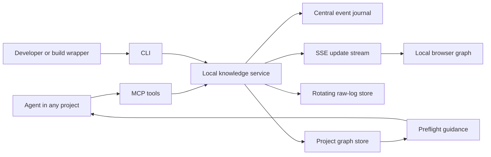

# Fishbowl Design

**Date:** 2026-07-13  
**Status:** Implemented — first local release
**Target repository:** `/Users/eric/fishbowl`

## 1. Purpose

Build a reusable, local-first engineering knowledge graph for development agents and developers. The system captures the full path from a build or test problem through failed attempts, proven root cause, effective solution, verification evidence, and the final successful case. Future agents consult this knowledge before running related work and record new evidence after each attempt.

The system is a standalone project. It does not live in, write knowledge files into, or depend on the Git history of `yqshunjian-ios-codex` or any other client project. Client projects are identified and isolated inside the knowledge system's own storage.

## 2. Goals

- Preserve failed attempts instead of retaining only the final patch.
- Require evidence for root-cause claims.
- Preserve the decisive difference between failed approaches and the successful solution.
- Treat successful cases as first-class reusable knowledge.
- Use mixed verification: automated evidence plus human confirmation when required.
- Warn agents before they repeat known mistakes; block only verified guardrails.
- Provide a live browser graph for all registered projects.
- Expose MCP tools so agents can create, query, and update project-level graphs.
- Keep raw build logs separate from durable knowledge.
- Require no product runtime integration and collect no end-user data.

## 3. Non-goals

- Product analytics, crash reporting, or production user diagnostics.
- Uploading iOS application logs from user devices.
- Replacing CI, Xcode, test frameworks, Git, or issue trackers.
- Automatically declaring a root cause solely from an error message.
- Permanently retaining every raw build-log line.
- Editing client repositories unless a user separately requests optional integration files.
- Hosting a public or internet-accessible service in the first release.

## 4. System Boundary

The project contains a local MCP server, a local knowledge service, a command-line client, a browser application, and central storage. It binds only to loopback interfaces by default.



No client application code participates in this data path. Build and parsing work runs in the standalone service process, never on an iOS main actor or rendering thread.

## 5. Multi-project Isolation

### 5.1 Project identity

Each registered project has:

- Stable internal `project_id` generated by the service.
- Human-readable name and optional description.
- Canonical root path.
- Optional Git remote fingerprint and repository metadata used only for matching.
- Explicit aliases for worktrees or renamed directories.

An agent must pass either `project_id` or `project_root` to project-scoped MCP tools. The service resolves the project deterministically and rejects ambiguous matches. It never silently assigns records to the most recently used project.

### 5.2 Storage ownership

All graph data is stored under the standalone system's data directory:

```text
/Users/eric/fishbowl/
  data/
    knowledge.db
    events/
    logs/<project-id>/
    exports/<project-id>/
```

The service repository tracks source code, schemas, documentation, and tests. Runtime data under `data/` is ignored by its Git repository. Client repositories receive no generated graph files and no automatic commits.

### 5.3 Worktrees

Multiple worktrees may map to one project. Command evidence records both the canonical project ID and the actual working directory. This preserves context without fragmenting one project's graph.

## 6. Knowledge Model

Each troubleshooting effort forms a `Case`. A Case contains typed nodes and directed relations.

### 6.1 Node types

- `Problem`: the engineering problem, symptoms, first observation, domain, and error fingerprint.
- `Attempt`: one concrete change or investigation, its hypothesis, command, result, and failure explanation.
- `RootCause`: the underlying causal explanation, supporting evidence, rejected alternatives, and confidence.
- `Solution`: the effective change, applicability, limitations, side effects, and decisive difference from failed attempts.
- `Verification`: automated or human evidence, environment, command, exit status, commit, scheme, destination, and bounded output excerpt.
- `SuccessCase`: the reusable path joining problem, failed attempts, root cause, effective solution, and verification.
- `Guardrail`: a verified preflight rule with matching criteria, guidance, and enforcement level.
- `Artifact`: an indexed reference to a build log, test result bundle, screenshot, report, or external issue without copying the full artifact into durable knowledge.

### 6.2 Core relations

```text
Attempt      --ATTEMPTS_TO_SOLVE--> Problem
Attempt      --PRECEDED_BY-------> Attempt
Attempt      --FAILED_BECAUSE----> RootCause
RootCause    --CAUSES------------> Problem
Solution     --ADDRESSES---------> RootCause
Solution     --VERIFIED_BY-------> Verification
Verification --REFERENCES--------> Artifact
SuccessCase  --INCLUDES----------> Problem | Attempt | RootCause | Solution | Verification
Guardrail    --PREVENTS----------> RootCause
Solution     --SUPERSEDES--------> Solution
```

Relations remain acyclic within a Case. Historical revisions create new versions or `SUPERSEDES` edges rather than mutating past evidence into a different claim.

### 6.3 Status model

- `open`: unresolved.
- `candidate`: plausible but insufficiently verified.
- `verified`: meets the mixed-verification policy.
- `regressed`: the problem recurred within the claimed applicability boundary.
- `retired`: no longer applicable because the underlying architecture or dependency changed.

## 7. Evidence and Mixed Verification

### 7.1 Automated evidence

Automated verification may include:

- Focused tests.
- Full test suites.
- Debug or Release builds.
- Static analysis and formatting gates.
- Deterministic repository verification scripts.
- CI results imported by an agent or wrapper.

Each record stores the command, exit code, duration, timestamp, working directory, source revision, relevant environment metadata, and a bounded redacted excerpt.

### 7.2 Human evidence

Human confirmation is required when correctness depends on visual behavior, real-device behavior, subjective product behavior, performance traces, signing, deployment, or an external system that automated tests do not prove.

### 7.3 Promotion rules

A Solution may become `verified` only when:

1. A RootCause exists and cites evidence.
2. At least one relevant automated verification succeeds, unless the problem is inherently non-automatable and that exception is recorded.
3. Required human verification is present.
4. The Solution records applicability and known limitations.
5. The successful Attempt states the decisive difference from earlier failed Attempts.

A full suite or merge gate can raise confidence but does not erase narrower evidence. If the same fingerprint recurs within the Solution's applicability boundary, the Solution becomes `regressed`; its original success evidence remains immutable.

## 8. Capture and Reuse Workflow

### 8.1 Preflight

Before related implementation, build, or test work, an agent calls the preflight MCP tool with the project, task description, changed files, and intended command. The service returns:

- Matching verified root causes and successful solutions.
- Known failed Attempts that should not be repeated.
- Open or candidate knowledge with explicit uncertainty.
- Applicable Guardrails.

Unverified knowledge is advisory. Only a verified Guardrail with `enforcement=block` may return a blocking result.

### 8.2 Execution capture

The optional CLI wrapper runs an arbitrary command without altering its arguments, streams output to the terminal, and records command metadata. It writes the complete output to rotating local storage and submits only a bounded redacted summary to the graph.

An MCP-only agent may instead submit an already observed command result. The API requires the project, command, exit status, and summary; full logs are optional.

### 8.3 Failure capture

On failure, the service uses an error fingerprint to suggest an existing Case or create a candidate Problem. Fingerprinting uses stable error codes, failing test identifiers, normalized compiler diagnostics, and selected stack symbols. Paths, timestamps, random identifiers, and unstable line numbers are normalized.

Automation may propose candidate causes but cannot mark a RootCause verified. The agent records its hypothesis, change, outcome, and why the Attempt failed.

### 8.4 Success capture

When work succeeds, the agent records:

- The proven RootCause and evidence.
- The final Solution.
- The difference between the successful and failed Attempts.
- All verification evidence.
- Applicability and limitations.

The service creates or updates the SuccessCase and evaluates promotion eligibility.

### 8.5 Regression

A later matching failure opens a regression event on the original Case. The previous Solution is downgraded only when the new failure falls inside its declared applicability boundary. A new investigation appends to the same Case; history is never overwritten.

## 9. MCP Contract

The MCP server exposes bounded, project-aware tools.

### 9.1 Project tools

- `register_project`: create a project graph from an explicit root path and name.
- `list_projects`: return registered projects and aliases.
- `resolve_project`: resolve a root path or alias without mutating data.
- `update_project`: update metadata or add a worktree alias.

### 9.2 Query and preflight tools

- `query_knowledge`: search by text, domain, node type, status, file, command, or fingerprint.
- `get_case`: return one Case with its nodes, relations, evidence, and history.
- `get_preflight_guidance`: evaluate known knowledge and Guardrails for intended work.
- `list_recent_activity`: return bounded recent project activity.

### 9.3 Capture tools

- `record_problem`
- `record_attempt`
- `record_root_cause`
- `record_solution`
- `record_verification`
- `record_artifact_reference`
- `record_guardrail`
- `record_command_result`
- `close_case`
- `mark_regression`

Write tools validate referential integrity, project ownership, allowed state transitions, and payload size. They return stable IDs and the updated promotion status.

### 9.4 Import and export tools

- `preview_import`: scan explicitly supplied files or Git ranges and return proposed nodes without writing.
- `apply_import`: apply an approved preview.
- `export_project_graph`: produce a portable redacted snapshot.
- `import_project_graph`: import a snapshot into an explicitly selected project.

The MCP server never scans arbitrary project files merely because it knows a root path. Import scope must be explicit.

## 10. Local CLI

The CLI mirrors the MCP capabilities for developers and shell workflows:

```text
fishbowl serve
fishbowl project register --root <path> --name <name>
fishbowl query --project <id> <text>
fishbowl preflight --project <id> --command <command>
fishbowl run --project <id> -- <command and arguments>
fishbowl case start|attempt|root-cause|solution|verify|close
fishbowl import preview|apply
fishbowl export
```

`fishbowl run` preserves the child process exit code and signal behavior. A knowledge-recording failure must not change a successful build into a failed build. A verified blocking Guardrail stops execution before the child starts and returns a distinct documented exit code.

## 11. Browser Application

The local browser application provides:

- Project selector.
- Directed graph with domain, type, status, and confidence filters.
- Search by ID, text, file, command, error code, and test name.
- Case timeline showing every Attempt in order.
- Detail panel for evidence, RootCause, Solution, limitations, and related artifacts.
- Live running, failed, verified, and regressed states via server-sent events.
- Read-only first release; mutations remain auditable through MCP or CLI.

The service binds to `127.0.0.1`. Cross-origin requests are denied by default. Internet exposure, remote authentication, and multi-user access are outside the first-release scope.

## 12. Persistence

### 12.1 Durable graph

Use SQLite in WAL mode as the central local store. The schema separates projects, cases, nodes, edges, evidence, fingerprints, guardrails, aliases, and append-only events. FTS indexes support text search. Every mutation writes an event and updates the materialized graph in one transaction.

### 12.2 Raw logs

Raw command output is stored under `data/logs/<project-id>/` with:

- Size-based rotation.
- Maximum total size per project.
- Age-based retention.
- SHA-256 digest stored with the Artifact reference.
- Redaction before durable excerpts are written to SQLite.

Raw logs are never committed automatically.

### 12.3 Portability

Project export produces a versioned JSON archive containing graph records and redacted evidence, excluding raw logs by default. Import validates schema version, IDs, and project ownership before applying changes.

## 13. Redaction and Safety

The service redacts common secret formats and sensitive command arguments before storing excerpts. It never stores environment-variable values by default. It records an allowlisted environment summary such as operating system, tool version, architecture, scheme, destination, and configuration.

Write limits protect the service from accidentally ingesting enormous logs. Paths are stored only when they belong to the explicitly registered project or the service's own data directory. Artifact references outside those boundaries require an explicit flag and remain references rather than copied content.

## 14. Failure Handling

- A failed knowledge write never hides or rewrites the underlying build result.
- Event and graph updates are transactional.
- The service detects an interrupted event replay and resumes from the last committed sequence.
- Malformed imports are rejected before mutation.
- SQLite corruption triggers a read-only error state and recovery guidance; the service does not silently replace the database.
- SSE clients reconnect from a sequence cursor and can request a fresh snapshot after a gap.
- Parser failures preserve command evidence as an unclassified Attempt instead of dropping it.
- Ambiguous project resolution is an error, not an implicit guess.

## 15. Initial Project Onboarding

For a newly registered project, onboarding is explicit:

1. Register the project and any worktree aliases.
2. Preview import from selected documents, test reports, and Git ranges.
3. Review proposed Problems, Guardrails, and SuccessCases.
4. Apply approved candidates.
5. Leave uncertain imports in `candidate` status.

For `yqshunjian-ios-codex`, useful initial sources include its architecture refactor log, engineering changelog, observability design, feature-delivery rules, tests, and selected Git commits. That import belongs to the central graph database and does not alter the iOS repository.

## 16. Verification Strategy

### 16.1 Unit tests

- Project identity and worktree alias resolution.
- Node and edge validation.
- Allowed state transitions and promotion rules.
- Regression downgrade logic.
- Error fingerprint normalization and deduplication.
- Guardrail matching and enforcement.
- Redaction and excerpt limits.
- Log rotation and retention.
- Event transaction and replay behavior.

### 16.2 Integration tests

- MCP tool calls create and query isolated project graphs.
- Two projects with similar errors never share records unintentionally.
- CLI wrapped commands preserve output and exit status.
- Failed Attempts followed by a verified Solution create a complete SuccessCase.
- SSE reconnect delivers missed events without duplication.
- Import preview makes no changes; apply imports only approved proposals.
- Export and import preserve graph integrity.

### 16.3 End-to-end acceptance

1. Register two independent repositories.
2. Record multiple failed Attempts for one project.
3. Record an evidenced RootCause and final Solution.
4. Add automated and human Verification records.
5. Observe the Case update live in the browser.
6. Run preflight and receive the successful path plus failed approaches.
7. Confirm the second project remains isolated.
8. Trigger a matching regression and verify the Solution is downgraded without history loss.

## 17. Delivery Slices

1. Core schema, event journal, project registry, and domain rules.
2. MCP query and capture tools.
3. CLI command capture and preflight.
4. Browser graph and SSE updates.
5. Explicit import preview/apply pipeline.
6. Hardening, portability, documentation, and end-to-end verification.

The implementation plan will decompose these slices into test-driven tasks after this design is reviewed.

## 18. Acceptance Criteria

- A new agent can register a project and create a project-level graph exclusively through MCP.
- Knowledge for one project never appears in another project's query without an explicit cross-project request.
- A Case preserves every failed Attempt and the final successful Attempt.
- Verified RootCause and Solution records contain evidence and applicability boundaries.
- Mixed verification gates promotion to `verified`.
- A regression preserves history and downgrades the affected Solution.
- Preflight returns known failures, root causes, successful solutions, and Guardrails.
- Only verified blocking Guardrails may stop a command.
- The browser updates active project graphs without a page refresh.
- Raw logs rotate separately from durable knowledge.
- No client repository is modified or committed by default.
- The first release runs locally and does not collect product user data.
