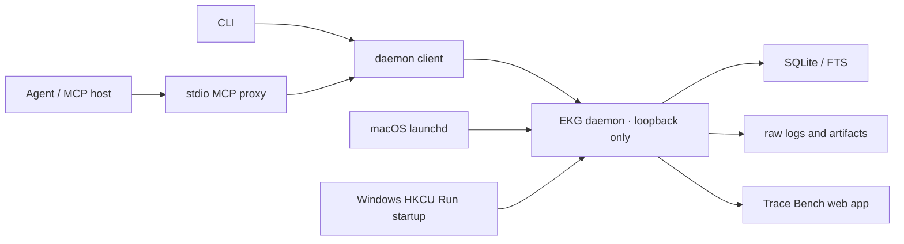

# EKG Daemon, Relevance, and Checkpoint Efficiency Design

**Date:** 2026-07-15  
**Status:** Proposed — awaiting written review  
**Target:** `/Users/eric/engineering-knowledge-graph`

## 1. Problem

EKG already improves long-term engineering memory, prevents repeated failures, and preserves decisions across long-running work. Its current net value is positive, but daily interaction remains slower and noisier than it should be:

- Agents report 5–10 second perceived CLI/query operations in fallback workflows.
- Permission approvals can time out and force write retries.
- Preflight returns too much weakly related history.
- Recording an Attempt through low-level CLI JSON costs more than some small changes.
- MCP failure falls back to a less reliable direct CLI/database path.
- Long-lived projects accumulate candidate Cases without automatic consolidation suggestions or age-aware ranking.

Direct measurement against a copy of the current 2.9 MiB database showed that embedded CLI cold start plus Preflight completes in about 0.12 seconds. The same representative Preflight serialized approximately 76 KiB because one large Case contributed many weakly related Attempts. The primary problems are therefore transport and permission reliability, response volume, result selection, and write ergonomics—not raw SQLite execution time.

## 2. Goals

- Make warm query and checkpoint operations feel immediate on macOS and Windows.
- Make a persistent local daemon the normal owner of SQLite and raw-log writes.
- Keep CLI and MCP compatible while routing both through the daemon.
- Rank and return Cases rather than allowing one large Case to flood node-level results.
- Put exact, verified, applicable knowledge ahead of weak historical matches.
- Reduce default Preflight output below 12 KiB and five Cases.
- Provide a concise, idempotent `checkpoint_work` MCP/CLI workflow.
- Avoid durable knowledge for routine successful work with no reusable conclusion.
- Suggest duplicate Case consolidation without destroying historical evidence.
- Apply age-aware ranking to unsupported candidates without expiring verified knowledge merely because time passed.
- Support user-level installation, diagnosis, startup, and uninstall on macOS and Windows with Node.js 22.

## 3. Non-goals

- Rewriting EKG in a native language or distributing a signed standalone binary in this release.
- Adding a cloud service, remote database, multi-user access, or internet listener.
- Automatically trusting a RootCause inferred from one successful command.
- Automatically merging Cases based only on text similarity.
- Deleting historical Attempts, candidates, regressions, or superseded knowledge.
- Modifying client project repositories or requiring administrator privileges.
- Guaranteeing latency introduced by an MCP host, operating-system approval UI, or another external process. EKG will remove its need for repeated filesystem approvals and separately measure its own latency.

## 4. Architecture



### 4.1 Daemon ownership

The daemon is the only normal SQLite and raw-log writer. It opens the database once, keeps prepared statements and bounded caches warm, and serializes project mutations through the existing transactional service layer.

The CLI and stdio MCP process become lightweight clients. The stdio process retains current MCP tool names and schemas, maps requests to the daemon protocol, and maps responses back to MCP results. Existing MCP host configurations remain valid after rebuilding or reinstalling the package.

### 4.2 Local protocol

Use versioned loopback HTTP with JSON request/response bodies and SSE for graph updates. The daemon binds only to `127.0.0.1` or `::1`; remote binding is not configurable in this release.

The daemon install creates a random bearer token and a local connection descriptor containing protocol version, selected port, daemon version, and token reference. The descriptor and token live in the user EKG configuration directory with owner-only permissions or the closest Windows ACL equivalent.

The Trace Bench browser receives a one-time launch token and exchanges it for an HttpOnly, SameSite local session cookie. Long-lived bearer tokens do not appear in browser URLs.

### 4.3 Embedded recovery

Direct database operation remains available only through an explicit `--embedded` flag for tests, recovery, and controlled maintenance. Normal CLI or MCP calls never silently fall back to embedded writes. This prevents sandboxed agents from unexpectedly writing outside a client repository and triggering repeated approval flows.

### 4.4 Platform data locations

- macOS configuration and data: `~/Library/Application Support/EKG`.
- Windows configuration and data: `%LOCALAPPDATA%\EKG`.
- `EKG_DATA_DIR` remains an explicit override for compatibility and test isolation.

Existing installations using `~/.engineering-knowledge-graph/data` are discovered and migrated only after an explicit install/upgrade command confirms the source and target paths. Migration does not delete the source.

## 5. Installation and Service Lifecycle

The npm package requires Node.js 22 and provides:

```text
ekg daemon install
ekg daemon start
ekg daemon stop
ekg daemon restart
ekg daemon status
ekg daemon uninstall
ekg doctor
```

### 5.1 macOS

Install a per-user `launchd` agent. It starts at login, restarts after unexpected exit with bounded backoff, inherits only an allowlisted environment, and writes operational diagnostics to the EKG data directory. Installation and removal do not require administrator privileges.

### 5.2 Windows

Install a current-user `HKCU\\Software\\Microsoft\\Windows\\CurrentVersion\\Run` entry that starts the daemon at login without an elevated administrator token. Client health checks restart the daemon after an unexpected exit. Registry mutations use `reg.exe` with structured arguments; ordinary lifecycle operations do not construct a shell command string.

### 5.3 Health and updates

`ekg doctor` checks:

- Node and package versions.
- Platform service registration and process health.
- Connection descriptor and token permissions.
- Loopback reachability and protocol compatibility.
- Database integrity and schema compatibility.
- MCP configuration path and daemon connectivity.
- A bounded warm query latency sample.

An upgrade performs: stop service, create a consistent database backup, install files, migrate schema, start service, run health checks, and report recovery instructions on failure. Uninstall removes the service and package integration but preserves knowledge data unless the user explicitly asks to remove it.

## 6. Query and Preflight Design

### 6.1 Case-level retrieval

Preflight stops returning independent lists of raw nodes as its default representation. It retrieves candidates through multiple indexed channels, scores Cases, then produces one compact knowledge card per selected Case.

Candidate channels:

- Exact normalized error fingerprint.
- Matching verified Guardrail criteria.
- Exact or normalized test name, symbol, file path, and command tokens.
- FTS5/BM25 text search.
- Applicability-boundary and environment compatibility.

The existing detailed node and Case APIs remain available for explicit expansion.

### 6.2 Ranking

Ranking gives the strongest weight to:

1. Exact fingerprint matches and verified blocking Guardrails.
2. Exact changed-file, test, symbol, or command matches.
3. Verified RootCause and Solution nodes.
4. Matching applicability boundaries and environment metadata.
5. Recent positive verification evidence.
6. Normalized BM25 text similarity.

Ranking penalties apply to:

- Candidate knowledge with no recent evidence.
- Regressed, retired, or superseded knowledge.
- Matches consisting only of common engineering terms such as `test`, `build`, or `Swift`.
- Cases with only failed Attempts and no evidenced RootCause or reusable Solution.
- Applicability boundaries that conflict with current tool, schema, platform, or version context.

Scores are explainable. Every card includes bounded `whyMatched` signals rather than exposing a meaningless scalar alone.

### 6.3 Compact knowledge cards

Default Preflight returns at most five cards. Each card contains:

- Case ID and title.
- Match explanation.
- RootCause summary when present.
- Effective Solution summary when present.
- One decisive failed route when relevant.
- Verification state, applicability boundary, and staleness indicator.
- An expansion cursor or `get_case` reference.

The entire default result is capped at 12 KiB after UTF-8 serialization. If the selected cards exceed the cap, excerpts are shortened deterministically before dropping lower-ranked cards. The response reports truncation and available expansion paths.

Preflight gains `detail=brief|standard|full`; `brief` is the default. `full` remains bounded and does not restore an unbounded node dump.

### 6.4 Staleness

- Candidate knowledge without positive evidence begins receiving an age penalty after 30 days.
- Candidate knowledge without evidence after 90 days is excluded from default results unless it matches an exact fingerprint, exact file/test/symbol, or an explicit Case request.
- Verified knowledge does not expire due to time alone.
- Verified knowledge is downgraded in ranking when its applicability boundary conflicts, it regresses, or it is superseded/retired.
- Pinning and explicit relevance feedback can affect ranking but never confer verification status.

### 6.5 Consolidation

An exact normalized fingerprint continues to attach a new Problem observation to the existing Case. Similar Cases without exact identity produce merge proposals containing evidence, similarity reasons, and conflicts. Applying a proposal preserves source IDs and history through explicit consolidation relations; it never deletes original events.

### 6.6 Relevance feedback

Add a project-scoped `report_relevance` operation with `useful|irrelevant` plus an optional bounded reason. Feedback adjusts future ranking for the same project and context class. It cannot promote a candidate, verify a RootCause, or retire a Case.

## 7. Performance Design

### 7.1 Warm process

The daemon opens and checks the database once per process start, prepares common statements, and maintains:

- A bounded project metadata cache.
- A bounded preflight result cache keyed by project ID, normalized context, detail level, and project graph revision.
- A bounded token/common-term cache.

Every mutation increments only the affected project's graph revision and invalidates that project's query entries.

### 7.2 Instrumentation

Record content-free timing for:

- Client connection and daemon queue time.
- Candidate retrieval.
- ranking/card construction.
- serialization.
- response transmission.
- checkpoint transaction.

Metrics store operation names, duration, response bytes, candidate/card counts, cache hit state, and stable error codes. They never store query text, node bodies, command output, environment values, or raw request/response content.

### 7.3 Budgets

- Daemon-internal Preflight p95 below 100 ms on the large deterministic fixture.
- Warm CLI end-to-end Preflight p95 below 250 ms on supported local macOS and Windows runners.
- Warm checkpoint p95 below 300 ms.
- Default Preflight response below 12 KiB and at most five Cases.
- A large Case occupies at most one default result card.

External MCP-host scheduling and user approval UI are reported separately from daemon latency.

## 8. Checkpoint and Write Design

### 8.1 High-level checkpoint

Add `checkpoint_work` to MCP and CLI. The minimal payload is:

```json
{
  "projectRoot": "/project/path",
  "task": "Fix Metal material flicker",
  "outcome": "failed",
  "summary": "Two-pass Gaussian improved local sampling but regressed total latency"
}
```

Optional fields include fingerprint, files, command, evidence, rootCause, solution, applicability, humanConfirmed, importance, and an explicit Case reference.

The service resolves the project/worktree, matches or creates a Case, links the previous Attempt, and performs the required existing writes in one transaction. It returns a compact result with stable project, Case, Attempt, promotion, and follow-up identifiers.

### 8.2 Capture policy

- Failed builds and tests create or update an Attempt automatically.
- New RootCause, reusable Solution, regression, or Guardrail knowledge must be durable.
- Routine successful command runs remain short-lived operational records unless they verify an existing Solution.
- Small successful changes with no reusable lesson may use `importance=routine`; they do not create a low-value Case.
- Inferred causes and solutions are candidates until the existing mixed-verification policy is met.
- Human/device/visual/performance confirmation remains explicit.

### 8.3 Idempotency and retries

The CLI and MCP proxy assign one stable idempotency key per incoming operation and reuse it across one bounded connection retry. The daemon stores the result keyed by project and operation ID. A write that committed before a lost response returns the original result when retried.

When the daemon is unavailable, the client asks the installed platform service to start once, waits for a bounded health window, and retries once. It then fails quickly with `ekg doctor` guidance. It does not enter embedded mode automatically.

The existing low-level write tools and `record_checkpoint` remain compatible for precise editing and recovery.

## 9. Schema and Migration

The next schema adds:

- Per-project graph revision.
- Relevance feedback.
- Merge proposals and consolidation relations.
- Evidence timestamps needed for staleness ranking.
- Optional normalized file, test, symbol, command, and applicability references when query-plan evidence shows they are needed.

Migration is transactional and preceded by a consistent backup. Existing Cases, nodes, edges, events, fingerprints, evidence, and source keys are preserved. Initial duplicate analysis creates proposals; it does not bulk-merge text-similar Cases.

Transport request/response bodies remain in a bounded in-memory retry cache and are not persisted. Durable write replay continues to use project-scoped operation IDs and the existing operation-result contract.

## 10. Failure Handling and Security

- The daemon selects and atomically records a new loopback port if its prior port is occupied.
- PID and lock state includes an instance nonce; stale state is cleared without signaling an unrelated process.
- Requests require the local bearer token and compatible protocol version.
- Non-loopback Host headers, cross-origin API requests, and unauthenticated requests are rejected.
- Rate and payload limits apply before JSON is materialized into graph writes.
- A corrupt or newer database enters read-only diagnostic mode and is never silently replaced.
- Parser or ranking failure returns the strongest safe exact-match results when possible and reports a stable degraded-mode code.
- SSE reconnects using a sequence cursor.
- Windows command execution uses argument arrays and does not invoke `cmd.exe` or PowerShell for ordinary service lifecycle operations.
- Secrets, environment values, and raw logs remain excluded from SQLite knowledge text under existing redaction rules.

## 11. Verification Strategy

### 11.1 Ranking golden set

Create redacted, deterministic fixtures shaped like the observed S1 Pro workload: schema-v1/v2 decisions, CoreML/Metal device failures, material-filter experiments, streaming validation, and unrelated Attempts. Assert:

- Exact verified RootCause/Solution knowledge appears in the top three.
- Schema-v2 rejection and schema-v1 guardrails outrank generic performance history for schema work.
- Material-flicker queries do not return an unbounded list of streaming Attempts.
- Weak common-term matches do not displace exact file, test, symbol, or fingerprint matches.
- Ranking explanations identify the decisive match signals.

### 11.2 Performance and size

- Benchmark cold daemon start separately from warm query latency.
- Measure CLI, MCP proxy, daemon query, ranking, serialization, and checkpoint paths.
- Assert default response size below 12 KiB on a Case with hundreds of nodes and events.
- Assert bounded cache invalidation affects only the mutated project.
- Use generous cross-platform timing ceilings plus deterministic query-plan and response-size assertions to avoid flaky CI.

### 11.3 Reliability

- Simulate response loss after commit and prove retry returns the same IDs without duplicate nodes.
- Simulate daemon absence, one service-start attempt, timeout, and actionable failure.
- Prove normal CLI/MCP paths never open SQLite directly.
- Prove `--embedded` remains explicit and functional for recovery.
- Prove concurrent clients preserve project isolation and transactional graph rules.

### 11.4 Staleness and consolidation

- Candidate age penalties apply at 30 and 90 days.
- Exact matches remain retrievable regardless of default staleness filtering.
- Verified knowledge remains available without new evidence when still applicable.
- Exact fingerprints attach to one Case.
- Text-similar Cases create proposals and never auto-merge.
- Applying a proposal preserves source history and IDs.

### 11.5 Cross-platform installation

- macOS tests install, start, restart, login-start, diagnose, stop, and uninstall the user `launchd` agent.
- Windows CI tests install, start, restart, validate the current-user `Run` entry, diagnose, stop, and uninstall the startup registration.
- Both verify paths containing spaces and non-ASCII characters.
- Both verify uninstall preserves data by default.

### 11.6 End-to-end agent journey

1. Install and start the daemon.
2. Configure an MCP host.
3. Run a compact Preflight against a noisy project.
4. Record a failed `checkpoint_work`.
5. Record evidenced RootCause, Solution, and mixed verification.
6. Repeat Preflight and receive the successful path in the top results.
7. Simulate a lost response and idempotent retry.
8. Open Trace Bench and observe the Case update through SSE.

Release gates remain typecheck, unit/integration/acceptance tests, browser tests when affected, build, `git diff --check`, and macOS/Windows installer CI.

## 12. Delivery Order

1. Versioned daemon protocol, connection descriptor, daemon lifecycle, and `doctor`.
2. Thin CLI/MCP clients with explicit embedded recovery mode.
3. Case-level ranking, compact cards, size budgets, and project-revision cache.
4. `checkpoint_work`, adapter-assigned idempotency, and bounded retry.
5. Staleness scoring, relevance feedback, and merge proposals.
6. macOS `launchd` and Windows `HKCU Run` installers.
7. Migration, golden ranking/performance fixtures, documentation, and complete release verification.

Each slice is implemented test-first and preserves current project isolation, redaction, graph validation, mixed verification, and append-only history contracts.

## 13. Acceptance Criteria

- macOS and Windows users can install, start, diagnose, and uninstall EKG without administrator privileges.
- The daemon is the only normal SQLite writer.
- Existing MCP tool names and current callers remain compatible.
- MCP and CLI do not silently enter embedded write mode.
- Warm daemon Preflight p95 is below 100 ms and warm CLI p95 is below 250 ms on the deterministic supported-runner fixture.
- Warm checkpoint p95 is below 300 ms.
- Default Preflight is below 12 KiB, contains no more than five Cases, and one large Case occupies one card.
- Exact verified and applicable knowledge outranks weak candidate history.
- Each card explains why it matched.
- `checkpoint_work` supports a useful four-field failure record and performs graph writes atomically.
- Lost responses and bounded retries do not create duplicate nodes.
- Routine successful work can avoid durable low-value knowledge.
- Candidate staleness lowers ranking without deleting history.
- Similar Cases are proposed for consolidation but are not automatically merged without exact fingerprint identity.
- Uninstall preserves project knowledge by default.
